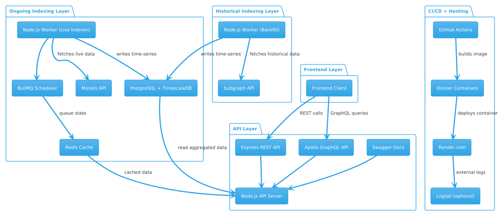

# POKT Metrics Monorepo



Cross-chain DeFi dashboard for tracking POKT prices, pool TVLs, and transaction volumes across Ethereum, Base, and Solana.

---

## Monorepo Structure

```
/packages
├── indexer       # Fetch + normalize data from Moralis APIs into TimescaleDB
├── api-server    # Express + Apollo GraphQL API exposing time-series data
├── frontend      # (coming soon)
```

---

## Quick Start

### 1. Install dependencies

```bash
pnpm install
```

### 2. Set up indexer environment (optional)

```bash
cp packages/indexer/.env.example packages/indexer/.env
```

### 2.1 Set database schemas (optional)

```bash
pnpm setup:db
```

### 3 Run indexer (optional)

```bash
pnpm dev:indexer
```

### 4. Set up API environment

```bash
cp packages/api/.env.example packages/api/.env
```

### 5. Start API server (GraphQL) and frontend (coming soon)

```bash
pnpm dev
```

GraphQL API: [http://localhost:4000/graphql](http://localhost:4000/graphql)

---

## Tech Stack

- **TypeScript** monorepo (`pnpm`)
- **TimescaleDB** (PostgreSQL 16)
- **Moralis API** (EVM + Solana)
- **BullMQ + Redis** for job scheduling
- **Apollo Server** (GraphQL over Express)

---

## Dev Tips

- Use `psql` or `pgAdmin` to inspect the TimescaleDB
- All timestamps are stored in **milliseconds**
- Use `to_timestamp(timestamp / 1000.0)` in raw SQL
