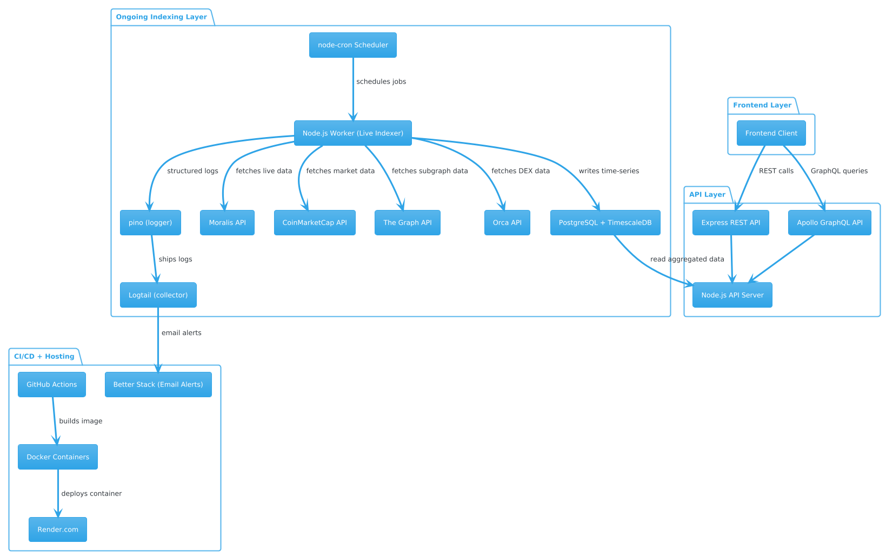

# POKT Metrics Monorepo



Cross-chain DeFi dashboard for tracking POKT prices, pool TVLs, and transaction volumes across Ethereum, Base, and Solana.

---

## Monorepo Structure

```
/packages
├── indexer             # Fetch + normalize current data from The Graph + Moralis + Orca + CoinMarketCap APIs into TimescaleDB
├── api                 # Express + Apollo GraphQL API exposing time-series data
├── client              # Frontend application
```

---

## Quick Start

### 1. Install dependencies

```bash
pnpm install
```

### 2. Set up indexer environment (optional)

```bash
cp packages/indexer/.env.sample packages/indexer/.env
```

### 2.1 Set database schemas (optional)

```bash
pnpm setup:db
```

### 3 Run indexer (optional)

```bash
pnpm dev:indexer
```

### 4. Set up API environment

```bash
cp packages/api/.env.sample packages/api/.env
```

- Make sure to set missing envs

### 5. Start API server (GraphQL) and frontend

```bash
pnpm dev
```

GraphQL API: [http://localhost:4000/graphql](http://localhost:4000/graphql)

- For documentation on API schemas, visit the graphql endpoint in the browser
- You will get redirected to an Apollo frontend that maps out all schemas and resolvers

Client: [http://localhost:3000](http://localhost:3000)

---

## Alternative Docker Setup

### 1. Set up root environment

```bash
cp .env.sample .env
```

### 2. Set up indexer environment

```bash
cp packages/indexer/.env.sample packages/indexer/.env
```

### 3. Set up API environment

```bash
cp packages/api/.env.sample packages/api/.env
```

### 4. Set up client environment

```bash
cp packages/client/.env.sample packages/client/.env
```

- Make sure to set missing envs

### 5. Run Docker Compose

```bash
docker compose up --build
```

GraphQL API: http://localhost:4000/graphql

---

## Tech Stack

- **TypeScript** monorepo (`pnpm`)
- **TimescaleDB** (PostgreSQL 16)
- **The Graph API** (EVM)
- **Orca API** (Solana)
- **Moralis API** (EVM + Solana)
- **CoinMarketCap API** (EVM + Solana)
- **Node Cron** for job scheduling
- **Apollo Server** (GraphQL over Express)

---

## Dev Tips

- Use `psql` or `pgAdmin` to inspect the TimescaleDB
- All timestamps are stored in **milliseconds**, but in the API, they are returned as seconds
- Use `to_timestamp(timestamp / 1000.0)` in raw SQL
